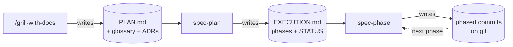

# Driving AI through big work

A repeatable flow: `grill-with-docs` → `spec-plan` → `spec-phase`

<div class="opacity-70 mt-4">

Any agent is fine on a 50-line change. This is the process I use to take one
through a **big, multi-file feature** without it losing the thread —
and it doesn't care which agent you run.

</div>

<div class="abs-br m-6 opacity-40 text-sm">
examples are generic · I run this on a real side project
</div>

<!--
Room is all agent users already (Claude, Codex, whatever). Skipping "what is an agent".
The whole talk is ONE thing: a workflow. Examples are deliberately generic so they're
followable. The specific project is just where I happen to run it.
-->

---
layout: center
class: text-left
---

# The problem is the size, not the model

The model is fine on a small diff. It falls apart on a big one.

- 🧠 **Context evaporates.** It forgets a constraint it agreed to earlier — and between sessions there's nothing to resume from.
- 🔍 **The diff is unreviewable.** 800 lines land at once. You skim it, rubber-stamp it, ship the bug.
- 🌀 **It drifts.** Starts strong, then quietly breaks something it already built.

<div class="mt-8 text-xl">

Fix: stop handing it <span class="text-red-400">a big task</span>.
Hand it <span class="text-green-400">a plan and a process</span>.

</div>

<!--
Everyone here has hit all three. The fix is not a cleverer prompt — it's structure
AROUND the agent: durable context + forced small phases. That structure is the flow.
-->

---
layout: center
---

# Two rules everything rests on

<div class="grid grid-cols-2 gap-8 mt-6">

<div class="p-6 rounded-lg bg-gray-800/50 border border-gray-700 h-full">

### 1. Git is the memory

Not the chat. Not the agent's head.

- branch name = **which phase**
- commits = **what's done**
- a `STATUS` block = the **only trusted prose**

A cold agent tomorrow reads *git*, not "where were we".

</div>

<div class="p-6 rounded-lg bg-gray-800/50 border border-gray-700 h-full">

### 2. Plan → phase → commit

No feature goes in as one blob.

- decisions get locked in **before** code
- work splits into **ordered phases**
- **one small commit** per step

Each phase is small enough to actually review.

</div>

</div>

<!--
These two ideas are load-bearing. The three skills on the next slide are just the
concrete machinery that enforces them.
-->

---

# The flow = three skills

Each one produces an artifact the next one consumes.



<div class="grid grid-cols-3 gap-4 mt-8 text-sm">

<div class="p-3 rounded bg-blue-950/40 border border-blue-800/40"><b class="text-blue-300">/grill-with-docs</b><br/>interview me until no decision is open, capturing terms + hard calls as we go. Output: <code>PLAN.md</code> (+ glossary, ADRs).</div>
<div class="p-3 rounded bg-blue-950/40 border border-blue-800/40"><b class="text-blue-300">spec-plan</b><br/>slice the plan into dependency-ordered phases + gates. Output: <code>EXECUTION.md</code>.</div>
<div class="p-3 rounded bg-blue-950/40 border border-blue-800/40"><b class="text-blue-300">spec-phase</b><br/>drive one phase: code, commit, verify, checkpoint. Output: <b>commits</b>.</div>

</div>

<!--
This is the spine of the talk. Three skills, three artifacts, one hand-off chain.
grill-with-docs is the front door — it bundles the grill-me interview with domain-modeling,
so the same session also leaves durable vocabulary + ADRs (next two slides). spec-plan is
the phasing engine; spec-phase is the driver. Walked on ONE generic example: "add comments".
-->

---

# Our running example

<div class="text-xl mt-4">

A feature big enough to hurt if you one-shot it:

</div>

<div class="mt-6 p-6 rounded-lg bg-gray-800/50 border border-gray-700 text-lg">

**"Add comments to posts."**

Signed-in users can comment and do one level of replies. Touches the
**database**, the **API**, the **client data layer**, and the **UI** — four moving parts.

</div>

<div class="mt-6 opacity-80">

Exactly the kind of task an agent starts confidently and then tangles halfway through.
Let's run it through the flow.

</div>

<!--
Deliberately generic. Everyone understands comments. The point is the SHAPE of the work
(full-stack, multi-layer), which is what makes phasing pay off.
-->

---

# 1 · `/grill-with-docs` → `PLAN.md`

`grill-with-docs` = the `grill-me` interview **with `domain-modeling` riding along**.
The agent interviews **me**, one decision at a time, until nothing is left vague.
First output is decisions, not code:

```md {all|4|5|6}{maxHeight:'260px'}
# Comments — Plan

## Decisions
| Storage    | `comments` table; `parent_id` self-FK for 1-level replies |
| Delete     | Soft delete (`deleted_at`) — preserve thread shape        |
| Reply depth| One level only. No deep nesting.                          |

## Out of scope
Moderation, notifications, edit history.
```

> The value here is **agreement before implementation**. Every "wait, what about deletes?"
> gets surfaced *now*, in English — not discovered halfway through a 600-line diff.

<!--
The PLAN is prose + tables. Zero code. It's the thing I review HARDEST — get the
decisions right and the code is mechanical. This is the same skill that built this talk.
Next slide: because domain-modeling rides along, the SAME interview also leaves durable docs.
-->

---

# 1b · The interview's durable residue

`domain-modeling` rides along, so the same session also writes what **outlives the
feature** — vocabulary and hard calls, straight into git:

<div class="grid grid-cols-2 gap-4 mt-6 text-sm">

<div class="p-4 rounded bg-blue-950/30 border border-blue-800/40 h-full">

### `CONTEXT.md` — the shared glossary

**Thread** · a top-level comment + its replies<br/>
**Reply** · a comment whose parent points at another; one level only

<div class="mt-3 opacity-75">The words the next agent must reuse — no re-arguing "comment" vs "reply" three sessions later.</div>

</div>

<div class="p-4 rounded bg-purple-950/30 border border-purple-800/40 h-full">

### `docs/adr/` — one decision per file

**0007 · Soft-delete comments** — `deleted_at`, never hard delete, to preserve thread shape. Trade-off: rows never leave the table.

<div class="mt-3 opacity-75">Only app-wide, hard-to-reverse calls land here — with the *why* attached.</div>

</div>

</div>

<div class="mt-6 opacity-90">

The <code>PLAN.md</code> dies with the feature. The <b>glossary and ADRs don't</b> — they're
durable context the next session inherits, git-tracked like every commit.

</div>

<!--
The domain-modeling half of grill-with-docs. The interview's throwaway is the PLAN; its keep
is the vocabulary + recorded trade-offs. Only app-wide, hard-to-reverse, real-trade-off calls
become ADRs — feature-local ones stay in the PLAN. This durable layer is exactly WHY the
always-loaded instruction file can stay lean — the payoff-section slide picks that up.
-->

---

# 2 · `spec-plan` → `EXECUTION.md`

The phasing engine. It slices the plan **along dependency layers** — not by size —
and writes a checklist file. For a full-stack feature that's the natural shape:

```md {all|1|2|3}
Phase 1 — Schema + API      # nothing downstream can start without this
Phase 2 — Client data layer # wire endpoints through, no UI yet
Phase 3 — Comment UI        # the part users actually see
```

- Each phase is **independently verifiable and revertable**.
- Phases **stack**: phase 2 branches off phase 1 *without waiting for a merge*. Keep moving.
- Every checklist item names **real files/functions** — a cold agent shouldn't have to re-read the whole plan to start.

<!--
This is the skill people never build themselves. It's not "chop into 3 bits" — it splits
on real dependency boundaries so each phase compiles and can be reviewed alone. Stacking
means I'm never blocked waiting for review.
-->

---

# What `spec-plan` actually writes

A `STATUS` block (the resume point) + each phase's checklist with **two gate lanes**:

```md {all|2-6|9-10|12-18}{maxHeight:'320px'}
## STATUS
- Current phase: 2 — in-progress
- Phase 1 — Schema + API: done
- Phase 2 — Client data layer: in-progress
- Phase 3 — Comment UI: pending
- Verification debt: none

## Phase 2 — Client data layer   (off comments/phase-1, stacked)
- [x] useComments(postId) query hook
- [ ] useAddComment / useDeleteComment mutations

**Agent gate (hard):**                          # local = pre-PR smoke check
- [ ] tsc --noEmit                              # project-wide, NEVER scoped
- [ ] vitest related --run <changed files>      # dependency-aware, not a file list
- [ ] CI green on the phase PR                  # the authoritative verdict
**Review checklist (user):**                    # I verify these by hand at review
- [ ] Posting a comment shows it without a refresh
```

<div class="mt-4 text-sm opacity-90">

**Local gate is the smoke check — CI is the verdict.** Typecheck runs **project-wide**: it's
cheap, and it's exactly what catches a shared-type change breaking every consumer. Tests follow
the **import graph**, not the edited-file list — widening to the full suite when a phase touches
shared surfaces. Whatever slips through, **CI's full run on the PR is authoritative.**

</div>

<!--
Two lanes matter: the agent gate is machine-checkable and gates the PR; the review
checklist is human-only and never blocks the agent. Keeps "did it typecheck" separate
from "does it feel right", and stops the agent from claiming it verified a browser flow.
The newer refinement: the local gate is only a pre-PR smoke check — typecheck stays
project-wide, tests follow the import graph (escalating to the full suite on shared surfaces),
and CI's run on the PR is the authoritative verdict the agent must drive to green before the
phase is done.
-->

---

# 3 · `spec-phase` → commits

Drives one phase. **Step 0 is always: read state from git**, not from chat memory.

```bash {all|1-2|4-8}
$ git branch --show-current      # the branch name IS the state
comments/phase-2-data-layer

$ git log --oneline
a1b2c3d  Check off phase 2: comment mutations
d4e5f6a  Add useComments query hook
7g8h9i0  Check off phase 1, open PR
b0c1d2e  Add comments API routes
f3a4b5c  Add comments table migration
```

- Work the checklist **top to bottom**, commit per step — never one giant commit.
- On finish: **run the local gate**, then stop and ask *"push + open PR?"* — a real checkpoint.
- After the PR opens: **watch CI**, fix red on the phase branch (no new ask — the PR was already authorized), report the phase done only when **green**.

<!--
The "Check off phase N" commits are the seam between plan and reality. If STATUS and git
ever disagree on a mechanical fact, git wins — silently. Commits are the progress bar.
"Done" now means CI-green, not just "the local gate passed" — CI's full run is the verdict,
and red on the phase PR is the agent's to fix before it can claim the phase complete.
-->

---

# What this replaces

You just watched git + `STATUS` drive a feature. Before the flow, state lived in
**one growing prose file** — `HANDOFF.md`, hand-updated at the end of every session.

```md {maxHeight:'190px'}
# Handoff — error-handling complete, pwa merged to develop
- Branch: phase-3 (off phase-2, off phase-1)
- A file was named in a commit message but never `git add`ed —
  it stayed untracked the whole session. Fixed by switching back
  a phase, committing it there, then moving the branch pointer...
```

It **went stale and hid failures** instead of catching them. Straight from the commit
that killed it:

> *"HANDOFF-as-state went stale and stacked branches forced cross-branch surgery."*

Nothing forced the prose to stay accurate. A `STATUS` block is a few regenerated lines —
and **on conflict, git wins.** That untracked-file slip is exactly what commit-integrity
checking now catches for free.

<!--
Placed AFTER the mechanism on purpose: now that git+STATUS has driven a full feature, here's
the real, recorded failure it grew out of. Not hypothetical — I ran the prose-handoff approach
and it broke in this specific, embarrassing way. The untracked-file incident is exactly what a
STATUS block + commit-integrity check catches automatically.
-->

---
layout: center
class: text-left
---

# The payoff: it's resumable

<div class="text-lg mt-2">

Walk away for a week. Come back. Or hand it to a **fresh agent** with an empty head.

</div>

<div class="mt-6 p-4 rounded bg-green-950/30 border border-green-800/40">

**Resume = read git + the STATUS block, keep going.** No "let me re-explain the project."
The branch says which phase, the checkboxes say which item, the STATUS says what's owed.

</div>

<div class="mt-4 flex gap-3 flex-wrap text-sm">
<span class="px-3 py-1 rounded bg-gray-700/60">pending</span>
<span class="px-3 py-1 rounded bg-blue-700/60">in-progress</span>
<span class="px-3 py-1 rounded bg-green-700/60">done</span>
<span class="px-3 py-1 rounded bg-yellow-700/60">done-with-debt</span>
</div>

<div class="mt-2 opacity-80 text-sm">
Explicit phase states — even <b>done-with-debt</b>, so deferred work is <em>named</em>, not hidden.
</div>

<!--
This is the whole "working memory" argument paying off. Durable context lives in git +
STATUS, so no single long session has to hold everything. This is why the flow beats
one heroic prompt.
-->

---

# Keep the always-on context lean

The agent-rules file (`CLAUDE.md`, `AGENTS.md`, …) is **re-injected into every single
message.** Every line you add is paid on *every* turn — in tokens, and in noise the model
wades through before it even reads your ask.

- So split durable knowledge by **how often it's needed**, not by "is it important":

<div class="grid grid-cols-2 gap-4 mt-2 text-sm">

<div class="p-4 rounded bg-green-950/30 border border-green-800/40 h-full">

**Always-on** — the rules file<br/>
A lean **index**: commands, conventions, and *pointers* to the deep docs. Small on purpose.

</div>

<div class="p-4 rounded bg-blue-950/30 border border-blue-800/40 h-full">

**On-demand** — git-tracked docs<br/>
The glossary, ADRs, and specs from `grill-with-docs`. Pulled in **only when the task touches them.**

</div>

</div>

- The instruction file is a **map, not the territory.** `grill-with-docs` fills the territory; the map just says where to look.

<!--
This is the second backlog item and it closes the loop with slide 1b. The durable docs
(glossary/ADRs) are precisely what lets the always-loaded file stay short: it points AT them
instead of inlining them. A bloated rules file taxes every turn and buries the actual request.
Same "durable context in git, not in the prompt" thesis, applied to the prompt itself.
-->

---
layout: center
class: text-left
---

# Sharp edges (it isn't free)

<div class="p-4 rounded bg-red-950/40 border border-red-800/50 mb-4">

**⚖️ The ceremony is overkill for small work.**
Grill → plan → phases on a typo is absurd. Full flow only for multi-file / architectural
changes; bounded fixes go straight to the edit.

</div>

<div class="p-4 rounded bg-red-950/40 border border-red-800/50">

**🧾 `done-with-debt` is real.**
Sometimes a phase ships with deferred items. The flow *names* the debt in STATUS —
but the debt still exists.

</div>

<!--
Credibility slide. Not selling snake oil — these three actually bite. Naming them is why
you should trust the parts that do work.
-->

---
layout: center
---

# TL;DR

<div class="text-xl leading-relaxed mt-4">

Don't hand the agent a <span class="text-red-400">big task</span>.

Hand it <span class="text-green-400">a plan</span>, sliced into <span class="text-green-400">small reviewable phases</span>.

Let <span class="text-blue-400">git</span> be the memory.

</div>

<div class="mt-8 text-sm opacity-70">
grill-with-docs → spec-plan → spec-phase
</div>

<div class="mt-6 text-center opacity-90">

None of this cares which agent you use. **The workflow is the value — not the tool.**

</div>

<div class="mt-6 opacity-60">
Questions?
</div>

<!--
Land the plane. Three skills, one idea: durable context + small phases, with git as
the source of truth.
-->
